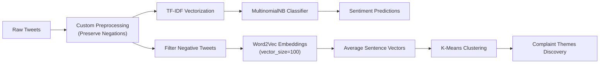

# ✈️ US Airline Sentiment Classification & Complaint Discovery Pipeline

An end-to-end NLP system designed to classify customer sentiment across thousands of airline tweets and automatically uncover recurring complaint themes using unsupervised semantic clustering.

---

## 📌 Business Overview

Major airlines receive massive volumes of customer tweets daily. While standard sentiment classifiers often misclassify critical feedback due to aggressive stopword removal (e.g., stripping "not" turns *"The service was not bad"* into negative), this pipeline implements **context-aware preprocessing** to preserve negation nuance.

Additionally, this project automates root-cause analysis by training distributed word embeddings (`Word2Vec`) on negative customer feedback and clustering common pain points (`K-Means`) for proactive customer experience resolution.

---

## 🚀 Key Technical Highlights

- **Custom Negation-Preserving NLP Pipeline:** Designed regex-based token cleaning and WordNet lemmatization while preserving critical negation words (`not`, `no`, `never`) to maintain context.
- **Supervised Classification:** Extracted statistical n-gram representations via `TfidfVectorizer` and trained a `Multinomial Naive Bayes` classifier (Fit strictly on training set to prevent data leakage).
- **Dense Word & Sentence Embeddings:** Trained a custom 100-dimensional `Word2Vec` model on filtered negative tweets and computed averaged sentence vectors.
- **Unsupervised Theme Discovery:** Clustered negative sentence embeddings using `K-Means` to extract underlying complaint categories (e.g., flight delays, lost luggage, customer support responsiveness).

---

## 📊 Pipeline Architecture & Workflow

## 📈 Performance & Results

> ### 🎯 Model Evaluation
> 
> * **Test Accuracy:** `84.76%`
> * **Macro Precision:** `91.57%`
> * **Negative Tweet Clusters Identified:** `4 Distinct Themes`

**🛠️ Tech Stack & Tools**

Programming Language: Python

Natural Language Processing: NLTK (stopwords, WordNetLemmatizer), Regular Expressions (re)

Machine Learning & Vectorization: scikit-learn (TfidfVectorizer, MultinomialNB, KMeans, metrics)

Dense Word Representations: gensim.models.Word2Vec

Data Manipulation: pandas, numpy
